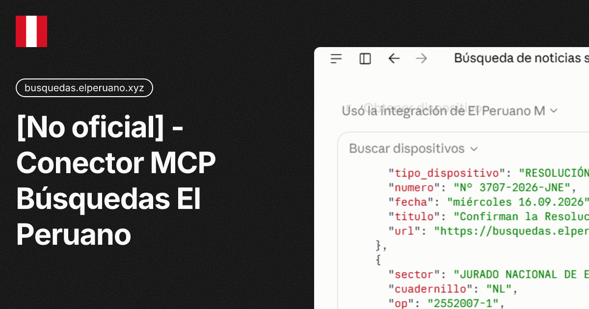

# elPeruanoMCP




Servidor MCP **local** para buscar y leer el Diario Oficial El Peruano
(normas, resoluciones, cuadernillos y PDFs) desde tu harness MCP.

> Herramienta **no oficial**: sin afiliacion con EL PERUANO y sin aceptacion
> de contribuciones externas. Ver [Aviso legal](#aviso-legal).

| | |
|---|---|
| Fuente de datos | [busquedas.elperuano.pe](https://busquedas.elperuano.pe) (publico) |
| Almacenamiento | **Ninguno** — el servidor nunca guarda archivos; los PDFs se entregan como URL |
| Herramientas | 9 |

## Instalacion

### Opcion 1: .mcpb (one-click, Claude Desktop)

1. Descarga `elperuanoMCP-0.3.1.mcpb` de la seccion
   [Releases](https://github.com/pipaacebedo/elPeruanoMCP/releases).
2. En Claude Desktop: Ajustes > Extensiones > instalar desde archivo, y
   selecciona el `.mcpb`.
3. Claude Desktop se encarga del entorno y las dependencias por ti.

### Opcion 2: uv (recomendada para desarrolladores)

1. Clona el repo: `git clone https://github.com/pipaacebedo/elPeruanoMCP`
2. Entra a la carpeta: `cd elPeruanoMCP`
3. Instala las dependencias: `uv sync`
4. Lanza el servidor: `uv run elperuano-mcp serve`

### Opcion 3: pip (sin uv)

1. Instala el paquete: `pip install .`
2. Lanza el servidor: `elperuano-mcp serve`

## Conectar el cliente

- **Claude Code**: `claude mcp add elPeruanoMCP -- uv --directory RUTA/elPeruanoMCP run elperuano-mcp serve`
- **ChatGPT**: seccion MCP/connectors de tu setup (config equivalente)
- **Otros harness**: config MCP equivalente (command + args)

```json
"mcpServers": {
  "elPeruanoMCP": {
    "command": "uv",
    "args": ["--directory", "RUTA/elPeruanoMCP", "run", "elperuano-mcp", "serve"]
  }
}
```

Al ser local, no hay autenticacion, tokens ni limites de ningun tipo.

## Herramientas

| Tool | Uso |
|---|---|
| `buscar_dispositivos` | Busqueda full-text con filtros (cuadernillo, sector post-filtro, fecha, rango) y paginacion deduplicada |
| `buscar_por_op` | Puntual por numero de orden (NNNNNNN-N); devuelve campos planos |
| `obtener_dispositivo` | Sumilla, tipo, numero, sector, fechas, texto integral (+ rango `desde/hasta` opcional) y `pdf_url` |
| `obtener_dispositivo_texto` | Texto por parrafos en rangos, con metadatos del dispositivo |
| `obtener_cuadernillo_texto` | Lee el PDF del cuadernillo en memoria: **busca texto dentro del PDF** (`query`) o lee por rangos de paginas |
| `listar_cuadernillos` | Cuadernillos por fecha o rango (max 7 dias), con filtro por tipo y `pdf_url` |
| `descargar_pdf` / `descargar_cuadernillo` | Devuelven la **URL publica** del PDF (no descargan nada) |
| `listar_tipos_publicacion` | Siglas y cuales tipos tienen dispositivos individuales |

## Como consultar

| Necesitas | Como |
|---|---|
| Frase exacta | Entre comillas dobles: `'"prescripcion adquisitiva de dominio"'` |
| Tema que cae en cuadernillos (PC/DJ/JU/CA) | `buscar_dispositivos` trae `cuadernillos_con_coincidencias` → `obtener_cuadernillo_texto(codigo, query="...")` localiza el texto dentro del PDF |
| Puntual por OP | `obtener_dispositivo(op="2558398-1")` — el cuadernillo se auto-resuelve |
| Un dia puntual | `fecha="20260923"` (acepta `2026-09-23` o `23/09/2026`) |
| Un rango | `fecha_ini` + `fecha_fin` |
| Solo Normas Legales | `cuadernillo="NL"` (siglas: NL, BO, EX, PC, DJ, JU, SE, CA, IN, TU) |

## Variables de entorno (opcionales)

| Variable | Default | Para que |
|---|---|---|
| `EPERUANO_BASE_URL` | `https://busquedas.elperuano.pe` | Origen de los datos |
| `EPERUANO_TIMEOUT` | `60` | Timeout HTTP |
| `EPERUANO_CACHE_TTL` | `300` | Cache en memoria (0 = off) |
| `EPERUANO_CACHE_BYTES` | `32 MB` | Presupuesto de cache por bytes |
| `EPERUANO_CACHE_MAX_ENTRY` | `3 MB` | No cachear paginas mayores a esto |
| `EPERUANO_MAX_PAGINAS` | `20` | Tope de paginas por llamada |
| `EPERUANO_MAX_CONCURRENCY` | `3` | Requests simultaneos hacia el sitio |

## Limitaciones y diseno

| Aspecto | Detalle |
|---|---|
| Filtros web Entidad/Tipo de dispositivo | No aplican server-side: incluye el organismo en `consulta` o usa `sector` como post-filtro |
| `coincidencias_texto` | Contador de coincidencias de texto del sitio (no dispositivos unicos); `dispositivos_unicos` cuenta los devueltos |
| PC/DJ/JU/CA/IN/TU | Sin dispositivo individual: el texto integral vive en el PDF del cuadernillo (`obtener_cuadernillo_texto` lo lee por paginas o con `query`) |
| Streaming | Paginas de busqueda se leen con corte en `</main>` (algunas superan los 100 MB de HTML; lo util es ~40-140 KB) |
| Cortesia | Cache por bytes + single-flight + semaforo de concurrencia para no sobrecargar la fuente oficial |
| Latencia | Busquedas sin filtro de cuadernillo pueden tardar 10-40 s (el sitio genera la pagina completa) |

## Aviso legal

- Herramienta de terceros **no oficial**, sin afiliacion con EL PERUANO ni
  con ninguna entidad publica.
- Provista **tal cual**; el autor no responde por el uso que se le de ni
  por la disponibilidad del sitio.
- Los datos son de acceso publico en busquedas.elperuano.pe; respeta la
  fuente: no la uses para scraping masivo.
- **Proyecto personal: no se aceptan contribuciones externas ni se ofrece
  soporte.** Puedes forkarlo y adaptarlo a tu criterio.

## Licencia

[Apache-2.0](LICENSE).
